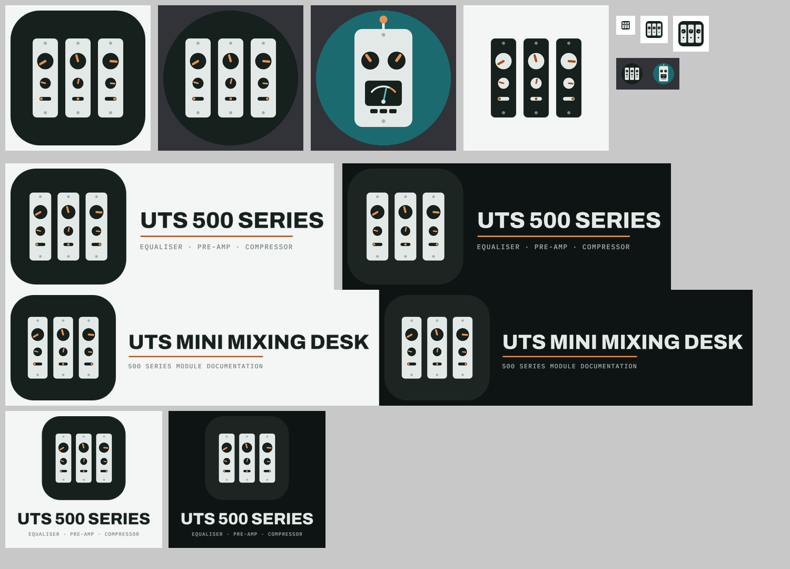

# UTS 500 Series logos

One family: three 500-series faceplates in a rack (Pre-Amp, EQ, Compressor) with their knobs turned up left to right.
Colours match the docs site: ink #16201D, faceplate #E3E9E6, amber #E5924F (audio path), teal #1B6A6F (control path).
Type is Archivo ExtraBold with IBM Plex Mono, outlined to paths so the SVGs need no fonts.

| Use | File |
|---|---|
| Project mark | uts500-mark.svg, png/uts500-mark-*.png |
| Mark with no tile (for light backgrounds) | uts500-mark-flat.svg |
| Project lockups | uts500-lockup-{light,dark}.svg, uts500-lockup-stacked-{light,dark}.svg |
| Site header lockups (site's own name) | site-lockup-{light,dark}.svg |
| Site favicon | favicon.svg, favicon.ico, png/favicon-{16,32,48}.png, png/favicon-180.png (apple-touch-icon), png/favicon-{192,512}.png (web manifest) |
| Discord server icon | png/discord-server-icon-512.png (upload this; Discord crops to a circle) |
| Discord bot avatar | png/discord-bot-avatar-512.png (Developer Portal > Bot > Icon) |

To change them: source/gen.py writes the SVGs, source/export.js renders the PNGs with Playwright.
gen.py expects archivo800.ttf and plex500.ttf (Google Fonts, OFL) next to it.
